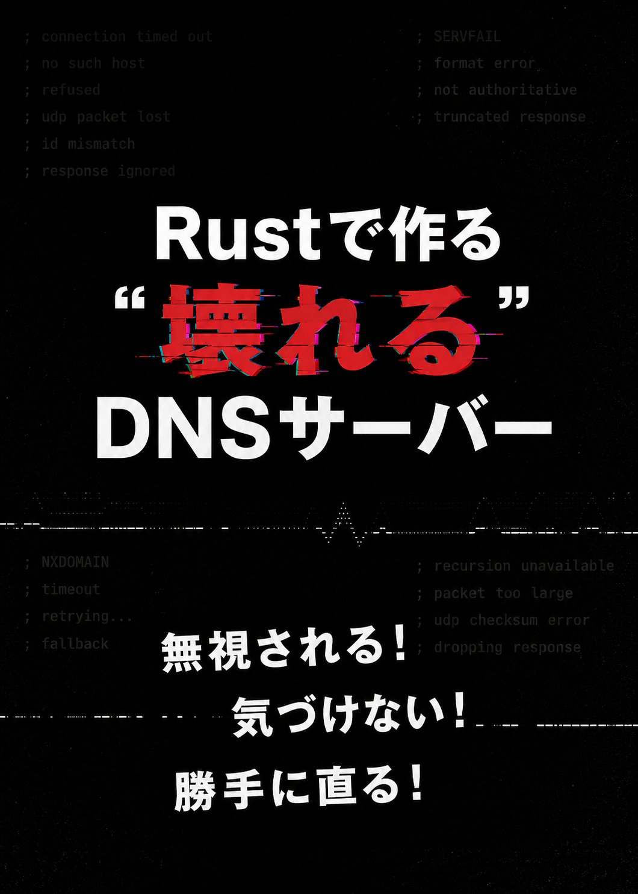

# rust-breakable-dns-resolver

<p align="center">
  
</p>

Rust製の「壊れるDNSリゾルバ」実験用リポジトリです。

DNSを単なる名前解決としてではなく、

```txt
なぜ壊れるのか
なぜその仕組みが必要なのか
```

を、実際に壊しながら理解することを目的にしています。

---

# このリポジトリで扱うこと

- UDP DNS resolver
- DNS packet parsing
- NXDOMAIN / NODATA
- delegation(NS)
- glue record
- CNAME
- cache / TTL
- negative cache
- timeout / retry / backoff
- tokio async化
- thundering herd
- DNS over TCP
- TCP fallback
- cache poisoning
- DNSSEC

---

# 特徴

このリポジトリは、

```txt
正しいDNSを作る
```

ことが目的ではありません。

むしろ、

```txt
壊れる実装
↓
問題を観測
↓
原因を理解
↓
改善
```

を重視しています。

そのため、意図的に脆弱な実装や不完全な実装も含まれています。

---

# ディレクトリ構成

```txt
.
├── attacker
├── auth-dev
├── auth-internal
├── resolver
├── scripts
└── work
```

## resolver

Rust製DNSリゾルバ本体。

```txt
resolver/src
├── main.rs
├── cache.rs
├── resolver.rs
├── dns_packet.rs
└── dns/
    ├── mod.rs
    └── parser.rs
```

| ファイル            | 説明                                          |
| ------------------- | --------------------------------------------- |
| `src/main.rs`       | UDP/TCP listener、cache確認、singleflight管理 |
| `src/resolver.rs`   | delegation / CNAME / upstream問い合わせ       |
| `src/cache.rs`      | positive cache / negative cache / TTL         |
| `src/dns_packet.rs` | DNS packet読み書き                            |
| `src/dns/parser.rs` | Header / Question解析                         |

---

# 起動

```bash
docker compose up -d --build
```

---

# 動作確認

```bash
dig @127.0.0.1 -p 33053 internal.test A
```

---

# cache poisoning 実験

```bash
dig @127.0.0.1 -p 33053 victim.internal.test A
```

脆弱状態では、attacker の偽レスポンスが cache store されます。

---

# 注意

このリポジトリには、

```txt
固定 Query ID
固定 source port
送信元未検証
```

など、意図的に危険な実装が含まれています。

実運用では使用しないでください。

---

# License

MIT
